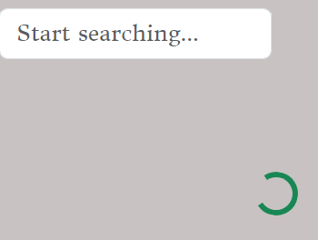
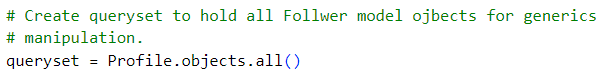

# Walking Seasons.
This project is the result of combining two repositories, a React frontend and a Django Rest Framework Application Programming Interface (API). 
This product will be using data saved and sent from the API to the React frontend to produce a user friendly website for interaction. 
The idea of this wesbsite is to offer a platform for users to share and comment on other users blurbs. The blurbs can be voted for, to show and highlight the best content. 
Users with the best blurbs on the website can be followed. 
All users will be able to view, create, edit and delete their own content. 

 

## Agile.
User Stories were created with [Github](https://github.com/) to develope ideas for a website where users can save and access their content to create blurbs about walkthing through different seasons, vote on the best content while following particular users that they enjoy hearing from. 
 

A User Story Project can be created within the repository itself to hold issues to follow, while creating the project. 
These User Stories can be created separately and linked to the project. 
 
Labels and status bars can be added to the user stories so they can be tracked for updates and progress. 
 
  

 

 

# Design.

## Colour Scheme.

The scheme for the website uses an array of colours to portait the vibrancy of these colours in all the different seasons avaliable to us. The grey scale background gives the website a more 'modern feel' with bursts of colour highlighting different areas. 
When moving from page to page, pops of colour help to show the user an icon or link they maybe hovering over, aswell as helping to highlight the current page the user is browsing. 
 
For [CCS](https://www.w3schools.com/Css/) in thie product Bootstrap styles are integrating in [React](https://react.dev/) functionality to help with design. 

## Typography.

The text styles used are from [Google Fonts](https://fonts.google.com/), they are installed by a link in the <em>'Head'</em> of the <em>'index.html'</em> page. 
Donegal One - This font held the colour grey very well. It looked agreeable in different grey scale tones and remained professional against the more elaborate Google Font of Delicious Handrawn. 
Sans Serif - Used for clear business standard text and is very readable. Placed incase a user finds the [Google Fonts](https://fonts.google.com/) chosen, not to work on their platform. 
Delicious Handrawn - The name of the font sounded appealing to use to help emphaise text describing the seasons. It is also used at different points on the website to just add contrast to the Donegal One font. 
 

## Icons.

[Font Awesome](https://fontawesome.com/) was used for icons throughout this project. They help portait different style faces including big grins for the Home page, encouraging winks for the sign up page and well known icons, for the well known social platform links. 
 

[Back to the top](#)

## Coding Diagrams.

Diagrams can help to find routes within the code to link models and access different parts of one model while making connections to and from different objects. 
 
 

 

# Features.

### Profile.
User can create a profile add images, edit content and view other user's profiles. The ability to edit profiles is targeted at each individual user. You will not be able to ammend other profiles. 
 

### Blurbs.

Blurbs can be created to hold titles, images and content about the picture. Or just an interesting piece of content by itself can be posted. 
Adding a visual image is always more appealing to the eye. 
Blurbs are talking point that users may want to share with others. A category for the photo or content can be selected to filter blurbs into 4 categories. 
The 4 categories are Spring, Summer, Autumn and Winter. 
The website will have the ability for the user to filter by Season to look at a particular one they have an interest in. 
 
A user can add a new blurb and add a title and content to an image. 
 
Each blurb shows the user who posted the blurb, date it was posted, image, title, content, whether it has been voted for and if any comments have been created about it. Clicking on the image itself takes you too the blurb own page which lists the comments underneathe. 

### Comments.

Everybody likes a discussion board, so a comment section has been created for users to make a comment or delete a comment about a particular blurb. 
 

### Voting.

User can vote for their favourite pictures. The most popular images and content with by filtered out and revealed for the user to access more easily. 
Voting can occur when a user is logged in and they can not vote on their own blurbs they have posted on the wesbite. This helps to keep the voting, fair. 
Votes can be created, viewed and deleted. 
 

### Voting Error.
I had noticed that the votes count increases by one when the post is creating and your taken to the blurb page. It does change to 0 and 'not count' as a vote when on the main Home page. 
This would need correcting at a later data. 

### Followers.

Followers/following/unfollow

 

### No results.

When there are no results in a search, a picture or a message will be displayed to the user. 
The user can use the search bar to try and find particular blurb pieces and this feature includes a no results page a particular phrase is not found. 
 
 
 

Other messages that are displayed to the user for direction, include a message about whether they can vote or follow a user or if they have to log in first. 
This is also the case for leaving comments. Both votes and comments are specified to each indiviual blurb and a count for each blurb for votes and comments are counted and shown to the user. 
the green thumb in this image shows the 'upvote' as positive, for that blurb. 
When removing a vote or comment you may have to go away from the page and come back to see the No results message if, no more votes or comments are avaliable. 
 

 

### Upload Content.

The user will have an image displayed to them when first creating a blurb, to update an image, by clicking the image.  
A React Spinner will be shown to the user while a page or search is loading making the website a better user experience. 
 

### Infinite Scroll.

The Infiniet Scroll component can be used from React so owners can continue scrolling while new content loads automatically. Pagination is set to show 10 blurbs per page but with infinite scroll set, the user can keep scrolling while new content loads. 
This is hard to demonstrate in a picture, but after 10+ blurbs are created the React component will function. 
Installing input for CLI: **npm install react-infinite-scroll-component**
This was installed in the terminal in the React frontend codespace - /workspace/api_5/frontend. 
 
The 'next' element was set in the API to hold a URL to the next page, aswell as previous. This is used in the props for infinite scroll to access this feature. 
 
 
Issues were faced within development mode using this component due to Gitpod error. It would continue to display the spinner prop with loading the next page fo the API. The correct results will be shown in production of project within continued scrolling. 

 
 

Noted topic wihtin slack community here: https://app.slack.com/client/T0L30B202/search  

### Drop down menu.

Th React component Dropdown, has been used to display a menu for the user to edit and delete their own posts. This will be visable when the image itself it clicked, itself of the updated time and date. 

### Popular section.

### News Feed.

### Navigation Bar.

A [React](https://react.dev/) Navigation bar has been used which make access to each element of the site simpler and more obvious. Using React, a toggle menu function is created for smaller screens to have a drop down menu which collapses and expands open on use mouse click, such as clicking on a link in the menu. 
Adjusted so the menu collapses by itself for better user experience, otherwise they would have to reclick the toggle menu button to close the expanded menu. 
A mouse click event Hook has been used to improve this function. 
Previously the menu would stay expanded and cover some of the content underneathe, before user clicks again. 
 

 

 

## Future Features.

Features can be added to greatly improv this website. 
A setTimeOut() function can be added to the search bar to slow the website response to keys presses. This would set a delay in which the searched items would appear, rather than flicking after each key stroke. 
 
It was noted that the votes count increases by one when the post is first created and your taken to the blurb page. It does change to 0 and 'not count' as a vote on the main Home page. 
This would need correcting at a later data.  

 

 

# Intialise REACT project.

No student template has been added to this project due to conflicting information with the [React](https://react.dev/) Application. A workspace for coding was created in [Github](https://github.com/) and opened into the coding enviroment, [Gitpod](https://www.gitpod.io/). 
App.js page holds all the routes. 

To initilise  [React](https://react.dev/) Application the command in th terminal is : **npm install**  This installs all the files neeeded for a [React](https://react.dev/) Application start point. 
To start To project, CLI input: **npm start** 
Depending on version that works a version may have ot be used. In this case extra code needed entering to ensure the project would run. 
CLI input enter enter time the workspace was run in a browser: 
- **nvm install 16.18.0**
- **nvm use 16.18.0**
- THEN **npm start** can be entered. 
  REPEAT EACH TIME WHEN RUNNING SERVER. 
 
Set up installations in 'project_5'. 
-  Enter into CLI:  
    -  **pip install django** ( pip3 install 'django<4>' - used here as prefered for Long Term Support (LTS)').
    -  **pip install django-cloudinary-storage**
    -  **pip install Pillow**
     

- Create **env.py** file for production state to save variables to not be pushed to [Github](https://github.com/). 
**Final Image for all secret files connected into workspace.** 

[Back to the top](#walking-seasons)

# React
Using [React Bootstrap](https://react-bootstrap.github.io/) removes the dependancy on bootstrap.js and jQuery.  
 
Due to the development stage of [React Bootstrap](https://react-bootstrap.github.io/), early versions maybe used. 
CLI input for installation is: 
- **npm install react-bootstrap@1.6.3 bootstrap@4.6.0** 
 
CSS link can be found in the documentation. Labeled 'Bootstrap Link' in index.html file. 
Each component from [React Bootstrap](https://react-bootstrap.github.io/) needs importing on each page it is used, for example: **'import Button from react-bootstrap/Button';** 
 
Best practise for each CSS file is to have a module.css file for each component. Example: NavBar.module.css for the NavBar component. They are applied by using the {styles.className} syntax. 
 

## React Router Library.

[React Router](https://reactrouter.com/en/main)Handle routing for URL's to render different pages within the webpage. 
CLI input for installation - **npm install react-router-dom@5.3.0**
The library controls what the user sees depending on what is render in the HTML for React App's. 
 
Routes to switch need to be added to the Index.js file including App.js. 
 
Paths for switching betweeen pages are added to the App.j file. 
 
 

### React Navigation.
[React NavBar](https://react-bootstrap.github.io/docs/components/navbar)
 
Wrap 'App' conponent inside <Router> on App.js page.
 

## React components.

## Axios Library.

Used to tell this React App to send request to the API. Enables they to communicate for better data transfer and changes. 
Using [Axios](https://axios-http.com/) also enabled combining workspaces between React and API. 
CLI input - **npm install axios**

### INFINTE SCROLL LIBARY 

**npm install react-infinite-scroll-component**  
 

### React Bootstrap Form
 
[React Bootstrap Form](https://react-bootstrap-v4.netlify.app/components/forms/)
Other Bootstrap items have been use throughout the project. Within the Form section alone, React Bootstrap classes called Images, Column, Row and Button have been used. 
React provides a boilerplate for individual coding to be added. This exmaple includes boilerplate and some starting code to transform it. 

 

 

### Context Hooks Refactoring

In React Frontend, context hooks were created to lessen coding in certain files sush as App.js. This help refactor and organise code when developing.
A new folder was created to separate out code. 
 
 
Code for each context are placed in a separte .js file. Now returned in context file. 
 
 
Decreases code in App.js  
 
 
Provider wraps App function for App.js in Provider. 
 
 
Context hooks set to fulfil their duties stated in the comments. 
 
 

[Back to the top](#walking-seasons)

# CRUD.

CRUD stand for Create, Read, Undo and Delete. This is four interactions the developer or the user can have with a website on either the frontend or the backend. 
[Django Signal](https://code.djangoproject.com/wiki/Signals) can be used for creating, retrieving, viewing and deleting data within the backend API. 
 
For React Frontend CRUD is also implemented for users to safely create blurbs without others being able to delete their content. If the owner wishes to update, edit or delete they can do so on their own content. 

Deleting and creating a vote can be done by the owner, if they dont own the blurb. Users will also be able to create a 'follow' and delete the 'follow' request to 'follow and unfollow' particular users. Again, this will be controled by the user being logged in as a particular user. 
 

# Django Rest Framework for an application programming interface (API).

Install [Django Rest Framework](https://www.django-rest-framework.org/). 
- CLI input - **pip install djangorestframework** 
- Add to INSTALLED_APPS as - **'rest_framework',** (with comma). 
- APIviews used for extra functionality for receiving instances, handling errors and adding context to Response objects and instances.

This workspace holds the API developed, for use with connection to Project 5, for backend storage for user interface requests. 
This is built to hold models and display content using React for the frontend of the project named, Project 5. 
This project contains storage and responses for HTTP requests, JSON Web Tokens for authentication, permission and to tell user input apart from other user input. 
The Django Rest Framework replaces the use of many HTML pages and displays the information requests using the React Frontend project, Project 5. 
 
Authentication for each user can be checked and monitored, for example, only a user of a certain profile can edit their information fields. 
In this example the owner of the profile is revealed as True and the user not logged in, is viewed as false. 
This can be built up, to access user information and their pertaining objects for manipulation depending on authenication criteria. 
 

 

 

## Serializers.
Data needs to be deserialized and serialized for the API to VIEW, GET, PUT, UPDATE and POST details from the models in views using serializers from the Rest Framework. 
 
As Applications are developed and models created, more serializers will be used to create JSON files for data manipulation when sending and receiving from the backend, to the frontend of the website. 
 

 

### Intialise API project.

Install [Django](https://www.djangoproject.com/) and intialise project in current directory of workspace using dot notation, **'.'** . 
Each application within the project is added further down. 
-  Enter into CLI:  
    -  **pip install django** ( pip3 install 'django<4>' - used here as prefered for Long Term Support (LTS)').
    -  **django-admin startproject name_here .** 'name_here' = 'api_5' for this project. 
    
    -  **pip install django-cloudinary-storage**
    -  **pip install Pillow**
     

-  Set up Cloudinary installations in 'api_5' **settings.py** under INSTALLED_APPS. See image. 

- Create **env.py** file for production state to save variables to not be pushed to [Github](https://github.com/). 
**Final Image for all secret files connected into workspace.** 
    - Entry for Cloudinary in **settings.py**. 
     
 

[Back to the top](#walking-seasons)

### Create Applications in API.

These steps can be repeated for more than one application. For example, new models, views and serializers can be added. Aswell as models can be registered to be used for administraion purposes. 
The application example in this API, can be repeated to create 'profiles', 'votes', 'followers' and 'blurbs'. 
- Create new application within the directory. 
    - Enter into the CLI: 
        - **python manage.py startapp profiles**
    - Add to INSTALLED_APPS like shown **'profiles',** 
      Don't forget the comma at the end. 

- At the top of **models.py** inside **profiles app** import Django User Model to reference it in our custom models. 
  Using '**from django.contrib.auth.models import User**'   
 - [Django Signal](https://code.djangoproject.com/wiki/Signals) is used to listen for events occuring in the models, that trigger a piece of code, method or function to run. 
This can encourage saving and deleting of new informtaion passed.
Imported into **profiles** app into **models.py**.  
- **from django.db.models.signals import post_save.**

- Import model created into **profiles** **admin.py**.
    - **from .models import Profile**
 

[Django](https://www.djangoproject.com/) is used to create url paths. 
 

[Back to the top](#walking-seasons)

## Access Admin panel
Create superuser, input for CLI: 
**python manage.py createsuperuser** 
Enter a Username and a Password. Skip email for easier option. 

### Authenication.
Authenication is important so a user will have the ability to view, create, edit and delete their own blurbs and comments. 
Using authenication of a user, only the logged in user can remove their vote that they have created. 
 
To further user experience, ease for authenication situations, [Django Rest Auth](https://pypi.org/project/dj-rest-auth/) can installed. 
CLI Input - **pip3 install dj-rest-auth==2.1.9**   (2.1.9 not necessary in input if different version preferred.)  
Followed by adding it to INSTALLED_APP in settings.py. 

[JSON web tokens](https://jwt.io/) (JWT) securely transmit data between and server as JSON objects. JWT are stored on the client side and they can be refered to as 'stateless'. 
Using Django's built in authenication module relies on Sessions for data storage. User experience can be improved with use of these sercuity measure which can deal with access and refresh tokens. 
 

Raw JSON data can be manipulated for a better user experience. Within the administraion panel to update items such as the Profile Application, a more user frendly approach can be used by setting the serializer class on a view, [Django Rest Framework](https://www.django-rest-framework.org/) sets it out in a form format automatically. 
 
The Bad Request can be shown here as a method to catch and raise errors. 
 
Status is OK and the input fields look much better for user and clients to input data. 
 

[Simple JWT](https://pypi.org/project/djangorestframework-simplejwt/) tokens will be used in production and for development, sessions is used. 
INSTALL CLI COMMAND 
**pip install djangorestframework-simplejwt** 
 

### Register
If a user would like to register [Django REST Auth](https://www.django-rest-framework.org/api-guide/authentication/) offers a standard registration process to install.  
CLI input - **pip install 'dj-rest-auth[with_social]'** 
Full information for the process can be accessed here: https://pypi.org/project/dj-rest-auth/  
 
Use of the [Django Rest Authentication](https://pypi.org/project/dj-rest-auth/) library enable handling of registraion, login, logout, user and token refresh. 
Credited from Code Institute is a map of dj-rest-auth endpoints for an API. 
 

 

[Back to the top](#walking-seasons)

# Technologies.

Content includes a range of technologies to create the frontend and back end portions of this project to help function and to improve the development, aesthetics, functionality and compatability. 
 
Some installations are necessary and more can be added to improve the website service and usefulness.

## Github and Gitpod.

A workspace for coding was created in [Github](https://github.com/) and opened into the coding enviroment, [Gitpod](https://www.gitpod.io/).
[Github](https://github.com/) offers a platform and cloud-based service for software development and allows management and storage for code.
[Gitpod](https://www.gitpod.io/) is open source developer platform ready for coding. Adding, commiting and pushing new work can be completed from the Command Line Interface [CLI](https://www.freecodecamp.org/news/how-to-use-the-cli-beginner-guide/), aswell as installing new packages, libraries, frameworks or programmes with pre-written code that can introduce into a new project to improve it.

## Starting Installations.

Steps to take for Starting a [Django Rest Framework](https://www.django-rest-framework.org/) based [API](https://www.ibm.com/topics/api). 

### Django.

[Django](https://www.djangoproject.com/) is installed as the Python based web development framwork. 
[Django Signal](https://code.djangoproject.com/wiki/Signals) is used for profile creation. This includes the retrieval (create) and update (edit) operations for CRUD (create, read, undo or edit and delete).

### Cloudinary.

Connect Django to [Cloudinary](https://cloudinary.com/) for storage and delivery of media such as images.
 - **pip install django-cloudinary-storage**

### Pillow.

This [Pillow](https://python-pillow.org/) library adds capabilities to process images. **'P' in Pillow needs to be a capital when installing**.

-  **pip install Pillow**

[Back to the top](#walking-seasons)

### RUN SERVER 

CLI input -- **python3 manage.py runserver** 
(IF URL NOT ALLOWED - ADD URL TO ALLOWED_HOSTS in settings.py). 
 

### NON-COMMITED FILE

A file called **env.py** should be created to hold environments for safely developing new websites. 
It should be entered into the .gitignore file to avoid being commited. 
This does involve saving a snippet of it incase the coding environment is closed and returned to at a later date, and a new environment is created. **The env.py is not saved**. 

## REQUIRED FILE.
### Requirements.txt file.

A file was created within the project to hold all the necessary input for these installed libaries in the project - **requirements.txt**. 
 

File required for Heroku use:

- Requirements.txt for local deploymemt.  

 

- Redirect to requirement.txt to store the files when installation is successfull.

- Either CLI input to be used:
    - **pip3 freeze --local > requirements.txt**. 
    - **pip freeze > requirements.txt** 

 

### POSTGRESQL LIBARY - ELEPHANTSQL.

[ElephantSql](https://www.elephantsql.com/) hosted the Database for storing data to be used within a cloud.

CLI input - **pip3 install dj_database_url==0.5.0 psycopg2**. 
Import dj_database_url into settings.py file.
See Deployment for further deployment details relating to this. 
 
Create a new instance in the appropriate region and then copy the URL to use in config vars for Heroku deployment. 
 

### MIGRATE CHANGES

Migrate changes are needed for each new App or change to the App. 
This includes new models or again, any changes too. 

CLI input - **python3 manage.py migrate**  

#### Check which migrations are to be made.

**python3 manage.py makemigrations --dry-run** 

#### To make the migrations shown.

**python3 manage.py makemigrations** 

#### To show any migrations that need to be done in a list, for indentification.

**python3 manage.py showmigrations** 

#### To complete the migration.

**python3 manage.py migrate** 

 

[Back to the top](#walking-seasons)

# Refactoring code

To refactor code, helps lessen the volume of lines of code. Using [Django Generic Views](https://www.django-rest-framework.org/api-guide/generic-views/) is one option that can be imported into the project to improve amount of code needs to GET, POST, PUT and DELELTE objects. 
[Django Generic Views](https://www.django-rest-framework.org/api-guide/generic-views/) use LIST, CREATE, RETRIEVE, UPDATE and DESTORY passed into function using options such as 'generics.ListCreateAPIView', 'generics.RetrieveUpdateDestroyAPIView' and 'generics.RetrieveDestroyAPIView'. 
Table of notes for Refactoring. 
 
Before Refactoring code for the comment section. 
 
 
After Refactoring the code for the comments section using [Django Generic Views](https://www.django-rest-framework.org/api-guide/generic-views/) 
 
 

[Django Generic Filtering](https://www.django-rest-framework.org/api-guide/filtering/) is used and offers better organisation of data for the users viewing pleasure. 
Filtering gets applied into the [queryset](https://docs.djangoproject.com/en/4.2/ref/models/querysets/). 
Use of queryset before filters are applied. 
 
 
After filters are applied. This improves user experience and increases the accuracy of counting votes and followers to use this data on the website. 
 
Their fields would need updating in their linked serializer and added the the meta class fields also. 
Extras such as ordering and search fields need including. 
 
Library that applies further filters for specific conditions. 
CLI input: **pip install django-filter** 
 

[Back to the top](#walking-seasons)

# Combining React project and DRF API.
Steps to take from Code Institute CourseWork. This enabled the React and API projects to be unified. 
 
 
 
 
 
 
 
 
 
 
CLIENT_ORIGIN_DEV needed removing from Config Vars in Heroku. 
 
 
 
 

# Deployment

To deploy this Full Stack project, [Heroku](https://dashboard.heroku.com/), a cloud based platform was used.
Follow the steps for deployment method: 
1. If needed, sign in and register to Heroku website first. _Click_ on **New** in the top right corner to create a new application.  
 

2. Add an application name. Follow the rules of what you can enter. Select a region, and _click_ **Create App**. 
 
3. Next stage will be a few changes on this page below. First, click into **Settings**. 
 
4. Once in **Settings**, Config Vars need altering. Remove <em>DISABLE_COLLECTSTAIC</em> on deployment if neceassary. 
DATABASE_URL needs adding config vars as key and value as the URL from [ElephantSql](https://www.elephantsql.com/). 
DATABASE in settings.py need updating for deployment also too: 

**if 'DEV' in os.environ: 
    DATABASES = { 
        'default': { 
            'ENGINE': 'django.db.backends.sqlite3', 
            'NAME': BASE_DIR / 'db.sqlite3', 
        } 
    } 
else: 
    DATABASES = { 
        'default': dj_database_url.parse(os.environ.get("DATABASE_URL")) 
    } 
    print('connected')** 
(CORRECT INDENTATION NEEDED FOR ABOVE CODE) 
 
Config Vars example on project deployment. 
 
 
**ALSO** 
<em>DEBUG</em> in settings.py need to be set to <em>FALSE</em> for deployment. 

5. Now _click_ into **Deploy**. This wesbite was connected to **Github**. Which can be selected at the top. The **orange line**, shows the location to connect your repository from **Github** to **Heroku**. _Enter_ the name of the repository you need and connect. This pictures shows the repository already connected via **Github**. _Scroll_ to the bottom of the page to deploy. Select **main branch** and _click_ **Deploy Branch**. 
 

6. The website may show as _building_ for a while. Once it has completed, it should look like the images below, with a **view** link. _Click_ here to view your website. 
 

Additionally needed files for Heroku use:
<ul>

<li>Profile. (Capital **P** needed.)</li>

</ul>
 
In preparation for Heroku deployment a view extra steps took place including adding root route, pagination to ListViews, providing a defualt JSON renderer and formtatting for date and time. 
 

### SERVER GUNICORN

To run [Django](https://www.djangoproject.com/) on, for [Heroku](https://dashboard.heroku.com/) devlopment.

CLI input - **pip3 install 'django<4' gunicorn**. 
CLI input **pip3 install gunicorn django-cors-headers** 
 
Add to requiremnts.txt file and add to INSTALLED_APPS and MIDDLEWARE in settings.py.  

[Back to the top](#walking-seasons)

## Clone website.

All installing and requirements for this project have to be completed correctly before a Clong of the website can be created.  

To clone the project. I _clicked_ **code** in the respository file. In the dropdown menu, **copy** the link. 
Here, on the image below,  the locations are highlighted in **pink**. 
 
Once cloned, **open** an IDE such as **GitBash**, to clone your wesbite. _Type_ **git clone** followed by your copied **URL link**. Hit enter.
 

[Back to the top](#walking-seasons) 

See [Testing](testing.md) file for full use of technologies used to test this wesbite. 

[Back to the top](#walking-seasons)

# Credits.

1. [Code Institute](https://codeinstitute.net/) for providing examples of [Django Rest Framework](https://www.djangoproject.com/) API building through [Code Institute](https://codeinstitute.net/) coursework to build backend parts to this project using databases, libaries, API Frameworks, Bootstrap, Django and Django Built-in benefits such as testing, and React for the frontend. This helped when creating my 'Profiles', 'Votes', 'Followers' and 'Blurbs' App's within this API.  

2. [Code Institute](https://codeinstitute.net/) for providing a React front end project to build called 'Moments'. Aswell as a Django Rest Framework API. 

3. [Stack OverFlow](https://stackoverflow.com/questions/61694370/why-is-alert-not-showing-on-my-react-app) for React Alert not showing. 

4. [CORS](https://stackoverflow.com/questions/28046422/django-cors-headers-not-work) error tips. 

5. [Stack Overflow](https://stackoverflow.com/questions/11488974/django-create-user-profile-on-user-creation) for checking model creation in API. 

6. [Infinite Scroll props](https://stackoverflow.com/questions/69926202/how-can-i-not-pass-children-as-props-instead-nest-children-between-the-opening) were attempted with improvements. 

[Back to the top](#walking-seasons)

# Awknowledgements.
To the **Tutor Support** team for [Code Institute](https://codeinstitute.net/) for continued support and assitance. 
To mentor **Precious Ijege** for continued support and patience while taking part in the course provided by [Code Institute](https://codeinstitute.net/) for a Diploma in Full Stack Software Development. 
To the Walkthrough projects of both <em>''</em> and <em>''</em> mini projects supplied by [Code Institute](https://codeinstitute.net/) Coursework. 

[Back to the top](#walking-seasons)

