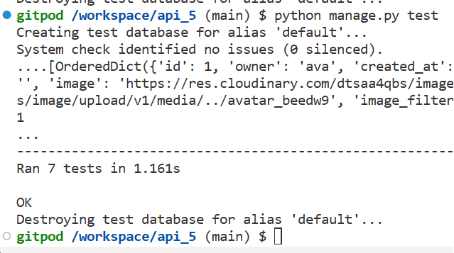
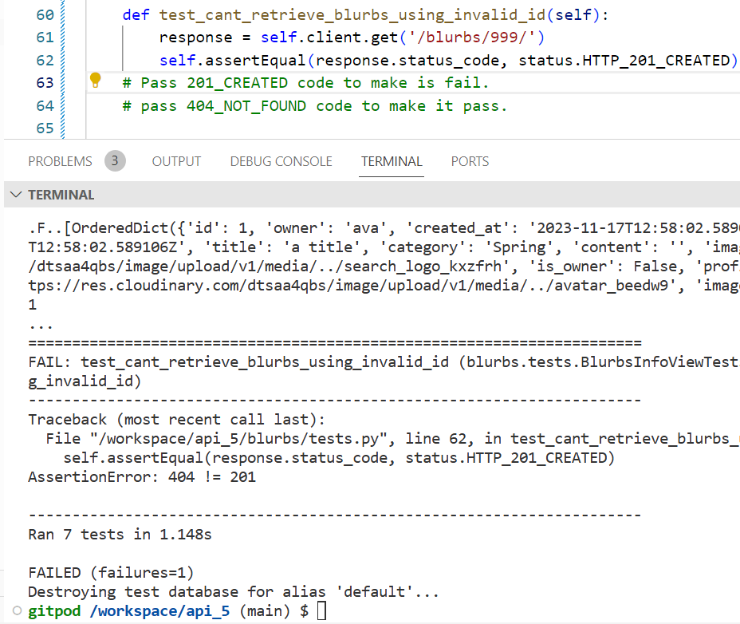
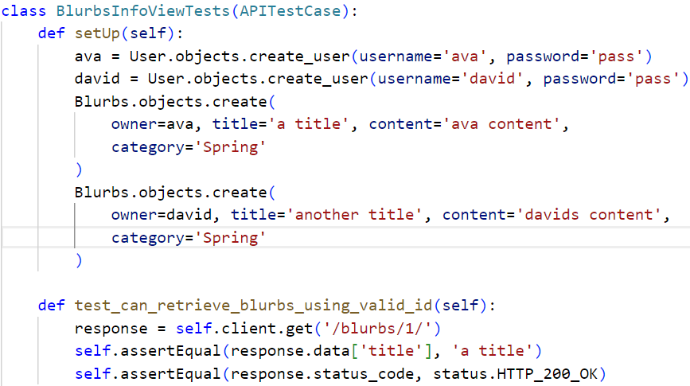
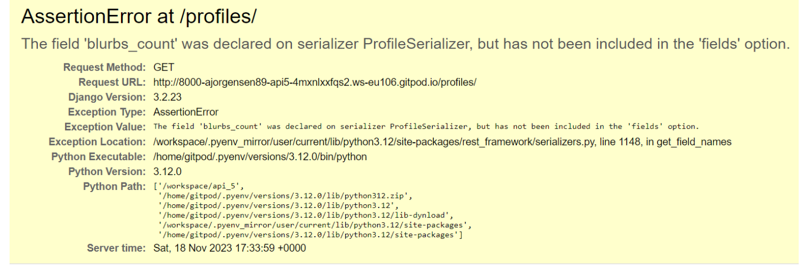
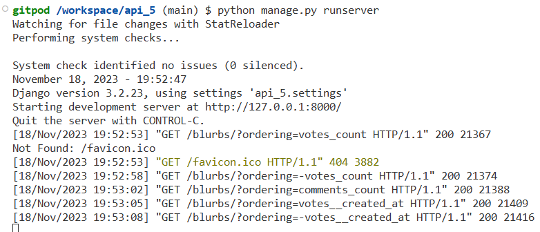
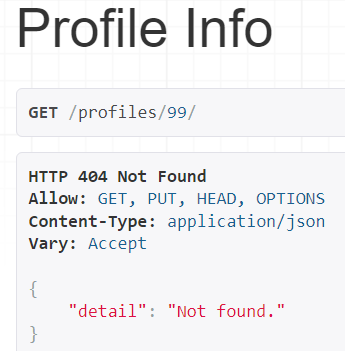
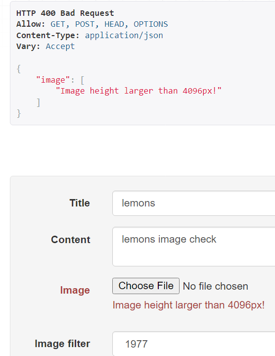
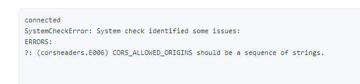
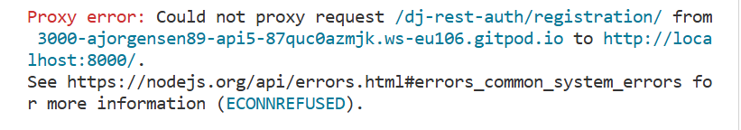
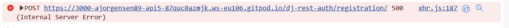

# Testing
This file holds examples of testing methods used for creating this API.

## PEP 8 linter.

[PEP8 CI](https://pep8ci.herokuapp.com/) with Code Institute to check [Python](https://www.python.org) code. 
 
PEP8 Packages can be installed in the coding environment. 

## Extension.
Extensions added to the workspace can help improve the experience of coding by assisting with debugging, Linters, formatting and much more.  
Example of using an exntension. 
 
 
Example of using an extention. 
 
 
[Flake8](https://flake8.pycqa.org/en/latest/) and [Python Linting Extentions](https://code.visualstudio.com/docs/python/linting) based extensions can be installed to help to perfect the look of a coding environment by providing linting support for [Python](https://www.python.org/) code. 
 
'Problems' tab within the coding workspace can be used to suggest problems within the code to be fixed with use of an extension. 
Example showing whitespace that needs to be removed and unused imports. 

 
'Problems' tab can identify many other issues thoughout building a website. 

## Django Rest Framework Testing

[Django Rest Framework](https://www.django-rest-framework.org/) offers testing libraries in built to test code.  
APITestCase needs to be imported from rset framework tests. 
CLI entry: **python manage.py test** 
 
Shown in image below. Tests show if they have run succesfully, after being tested in the code to fail, using appropriate HTTP status codes. 

 
 
Tests can be set to fail depending on the HTTP status code. This image depicts a test failing, and the code needed for it to pass. 

 
 
A test should be 'set up' to create a 'situation' to run a test against. 
Each class contains (APITestCase) in the class and each method starts with 'test' 

 

Testing hints pop up when coming in contact with a piece of code that may not be working properly. 
 

Terminal in the workspace shows errors and success messages when running code. 
 
 

## Errors.
Documentation used when facing some [Errors](https://nodejs.org/api/errors.html#errors_common_system_errors). 
Catching errors can be important to enhance a user experience and ease for navigating a website. 
This error raised when invalid id was entered in to the URL. 

 
 
Image validation error message ensure large images do not get uploaded. Improves experience and decreases loading times. 
 

- Errors faced. CORS error. CLIENT_ORIGIN_DEV had not been removed from Heroku Config Vars. 

 
- Errors faced. Proxy error. 

 
- Errors faced. POST error. 

 
 

### User input Errors.

To lessen user error when entering information onto the website such as username, password and confirm password a 'try' 'catch' error block if created. 
[React Alerts](https://react-bootstrap.github.io/docs/components/alerts/) is used to hold messages to show to the user. Javascripts [Optional chaining (?)](https://developer.mozilla.org/en-US/docs/Web/JavaScript/Reference/Operators/Optional_chaining) and  Pythons [Django 'non_fields_error'](https://docs.djangoproject.com/en/4.2/ref/forms/api/) used also. 

[Back to the top](#testing)

[Back to README.md](README.md)

