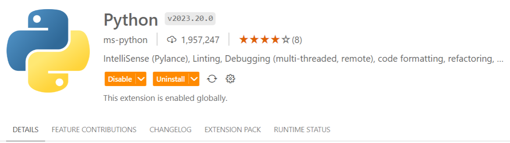
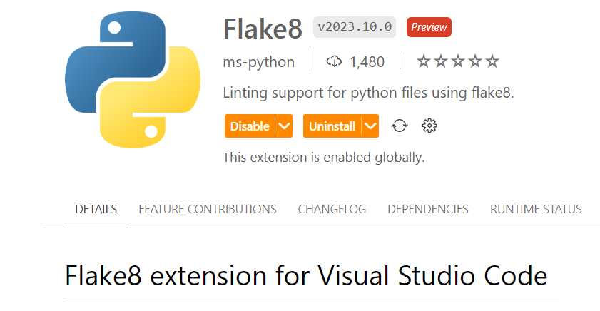
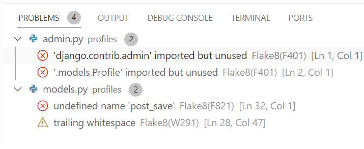

# Testing
This file holds examples of testing methods used for creating this API.

## PEP 8 linter.

[PEP8 CI](https://pep8ci.herokuapp.com/) with Code Institute to check [Python](https://www.python.org) code. 
 
PEP8 Packages can be installed in the coding environment. 

## Extension.
Extensions added to the workspace can help improve the experience of coding by assisting with debugging, Linters, formatting and much more.  
Example of using an exntension. 
 
 
Example of using an extention. 
 
 
[Flake8](https://flake8.pycqa.org/en/latest/) and [Python Linting Extentions](https://code.visualstudio.com/docs/python/linting) based extensions can be installed to help to perfect the look of a coding environment by providing linting support for [Python](https://www.python.org/) code. 
 
'Problems' tab within the coding workspace can be used to suggest problems within the code to be fixed with use of an extension. 
Example showing whitespace that needs to be removed and unused imports. 

 
'Problems' tab can identify many other issues thoughout building a website. 

 

[Back to the top](#testing)

[Back to README.md](README.md)

