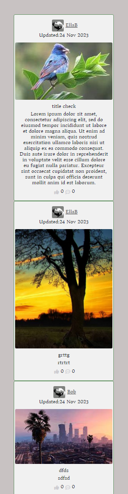

# Testing
This file holds examples of testing methods used for creating this API.

## PEP 8 linter.

[PEP8 CI](https://pep8ci.herokuapp.com/) with Code Institute to check [Python](https://www.python.org) code. 
 
PEP8 Packages can be installed in the coding environment. 

## Extension.
Extensions added to the workspace can help improve the experience of coding by assisting with debugging, Linters, formatting and much more.  
Example of using an extention. 
 
 
Example of using an extention. 
 
 
[Flake8](https://flake8.pycqa.org/en/latest/) and [Python Linting Extentions](https://code.visualstudio.com/docs/python/linting) based extensions can be installed to help to perfect the look of a coding environment by providing linting support for [Python](https://www.python.org/) code. 
 
'Problems' tab within the coding workspace can be used to suggest problems within the code to be fixed with use of an extension. 
Example showing whitespace that needs to be removed and unused imports. 

 
'Problems' tab can identify many other issues thoughout building a website. 

## Python Linting.

Test were carried out on different Linting platforms including:
- [Code Institute Linter](https://pep8ci.herokuapp.com/)
- [Visual Studio code](https://code.visualstudio.com/docs/python/linting)
This helped to indentify linting errors within the code to establish and better format for the workspace environment. 
[Visual Studio code](https://code.visualstudio.com/docs/python/linting) 
 

 
[Code Institute Linter](https://pep8ci.herokuapp.com/) 
 
 

Some corrections suggested, such as removing whitespace from after and before the curly braces in { Navlink }, for example, did not improve my code, therefore it was left. Same as the linter request to remove many semi-colons from areas where I felt they were neccessary, were not removed. 

# Django Rest Framework API Testing

[Django Rest Framework](https://www.django-rest-framework.org/) offers testing libraries in built to test code.  
APITestCase needs to be imported from rset framework tests. 
CLI entry: **python manage.py test** 
 
Shown in image below. Tests show if they have run succesfully, after being tested in the code to fail, using appropriate HTTP status codes. 

 
 
Tests can be set to fail depending on the HTTP status code. This image depicts a test failing, and the code needed for it to pass. 

 
 
A test should be 'set up' to create a 'situation' to run a test against. 
Each class contains (APITestCase) in the class and each method starts with 'test' 

 

Testing hints pop up when coming in contact with a piece of code that may not be working properly. 
 

Terminal in the workspace shows errors and success messages when running code. 
 
 

## Errors.
Documentation used when facing some [Errors](https://nodejs.org/api/errors.html#errors_common_system_errors). 
Catching errors can be important to enhance a user experience and ease for navigating a website. 
This error raised when invalid id was entered in to the URL. 

 
 
Image validation error message ensure large images do not get uploaded. Improves experience and decreases loading times. 
 

 
On occassion the logout request would take a few tries of a mouse click interaction to logout. Console Log errors show a token refresh, but then went to clicked again, with no changes, it would log out the user. 
 
 

It was noted that occasionally on login, even when the home screen was able to view when logged out, the counts from comments or votes would not appear. However in this image, the comments are seen and s user is not logged in. 
 

[Back to the top](#testing)
 
 

A POST error kept popping up and was unhappy regarding leaky code in an unmounted component wihtin the useEffect React function. Using some guidance from ChatGPT, I found a model to a solution and adapted it for use for this project by setting a clean up, like it suggests. 
**Code Error showing in console log as a POST error.** 
 
 
**Suggested solution to be implemented.** 
 
 
**Code that was adapted to remove POST error in console. Setting a clean up for the useEffect function when fetching posts.** 
 
 

Console log error seemed to be coming from the package.json files. 
Tampering with this code did not seem a smart idea due to skill level and understanding so they were left alone. 
Error logged for the project as noticed. 

Console Log error messgae.  
 

Noted areas where the issue of 'classname' not 'className' was found within the workspace. 
 

Developers that create the packages are responsible for these errors in the image below. Fixes maybe released and can be applied with an **npm audit fix** 
 

# User input Errors.
Demonstrates errors faced when building the frontend React portion to this project. 

To lessen user error when entering information onto the website such as username, password and confirm password a 'try' 'catch' error block if created. 
[React Alerts](https://react-bootstrap.github.io/docs/components/alerts/) is used to hold messages to show to the user. Javascripts [Optional chaining (?)](https://developer.mozilla.org/en-US/docs/Web/JavaScript/Reference/Operators/Optional_chaining) and  Pythons [Django 'non_fields_error'](https://docs.djangoproject.com/en/4.2/ref/forms/api/) used also. 
 
Alerts have been used to display message for errors that may occur due to incorrect use input. This example shows errors being captured and shown to the user for empty username and password fields. 
 
 
Alert message shown for incorrect password errors. 
 
 
POST errors can be seen in the console as developing. In this example, the error is because the Username already exsists so a POST response was not created and the user is alerted with a warning message. 
 
 
POST error, aswell as other errors, are always generated in the workspace terminal. 
 
 

Correctly signals, POST and GET, are also seen in the terminal for confimation that the frontend is communicating with the API backend. 
 
 

- Error faced when combining the API and React projects. CORS error. CLIENT_ORIGIN_DEV had not been removed from [Heroku](https://dashboard.heroku.com/login) Config Vars. 

 
- Errors faced. Proxy error. 

 
- Errors faced. POST error. 
This error kept appearing once the backend and frontend projects had been combined. 
If the backend API **python manage.py runserver**, had not been entered to get the server running in conjuction with the React frontend server which ran on 'nvm install 16.18.0', 'nvm use 16.18.0', then 'npm start', these errors would appear. To run in the react frontend, A Frontend folder was created in the directory. All commands for the frontend were ran here. CLI **cd frontend** to ensure inside the correct folder. 
This error showed together with the above Proxy Error. 

 
- Coding error for mapping the full array of blurbs. The data arrray would return and was printed in console log. 
 
This error was spotted and fix as the full array have not been mapped through using map() function to get all blurbs in the API. 
 
 

- When creating commentary within my files, I had commented out a vital piece of code that caused issues when running the website. This took a good couple of days to find and solve as it was causing a few different errors. 
With the help of a Slack Community Individual, the problem was found and resolved. 
 
 

## Unauthorized user check errors.

These network requests will always display in console.log when first signing in as these three, together, confirm whether a user is actually logged out. 

When first loading the development website, it would get 'sticky' going back and forth to workspace and hosted website. An extra CTRL + ALT + R to refresh would tend to sort the page links when navigating.
This maybe due to the local timestamp being set still in local storage. 

When the page is refreshed, a 400 error is sent due to no username input on sign in. 

## React Dev Tools

The website can be inspected by right clicking on the mouse to bring up Developer Tools to help assist with errors.
 

[React Developer Tools](https://chromewebstore.google.com/detail/fmkadmapgofadopljbjfkapdkoienihi) can be found on particular website and used as a developmental tool. Components and profiler options are given to look through to help find issues within code and what maybe causing an error. 

[Back to the top](#testing)

[Back to README.md](README.md)

